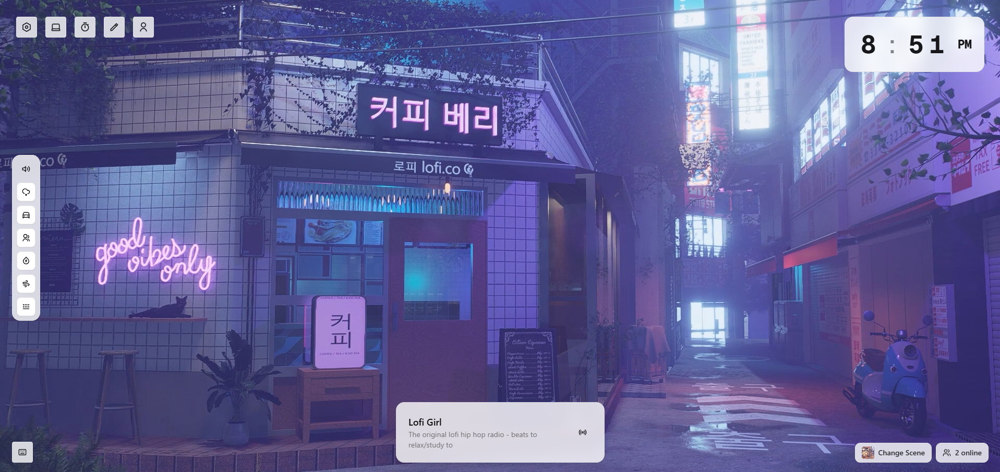

# 🌿 LofiVibes

Immerse yourself in soothing lofi beats and ambient sounds. LofiVibes offers a beautiful, minimal environment for studying, working, and relaxation. Built with Next.js 15, TypeScript, and modern web technologies.



## ✨ Features

### 🎵 Immersive Environment

-   Multiple beautiful scenes (Book Cafe, Cozy Studio, and more)
-   Dynamic day/night transitions
-   Customizable ambient sounds:
    -   Rain
    -   City Traffic
    -   People Talking
    -   Ocean Waves
    -   Wind
    -   Keyboard Typing
-   Volume control for each sound effect
-   Scene preview and easy switching

### 🎧 Music Player

-   Curated lofi music selection
-   Play/pause and skip controls
-   Volume control
-   Beautiful audio visualizations
-   Progress bar with time display

### ⚡ Enhanced Experience

-   🌓 Dark/light mode support
-   ⏰ Pomodoro timer with customizable intervals
-   � Real-time chat with other listeners
-   🔄 State persistence across sessions
-   📱 Responsive design for all devices

### 🛠️ Technical Features

-   Built with Next.js 14 App Router
-   TypeScript for type safety
-   TailwindCSS for styling
-   Shadcn/UI components
-   Zustand for state management
-   Pusher for real-time features
-   Prisma with PostgreSQL
-   NextAuth.js for authentication

## 🚀 Getting Started

1. Clone the repository:

```bash
git clone https://github.com/hongducdev/lofivibes.git
```

2. Install dependencies:

```bash
pnpm install
```

3. Set up environment variables:

```bash
cp .env.example .env
```

4. Start the development server:

```bash
pnpm dev
```

## 📝 License

[MIT License](LICENSE)

## 🙏 Credits

-   Music provided by [Lofi Girl](https://lofigirl.com/)
-   Icons by [Lucide](https://lucide.dev/)
-   UI Components by [shadcn/ui](https://ui.shadcn.com/)
